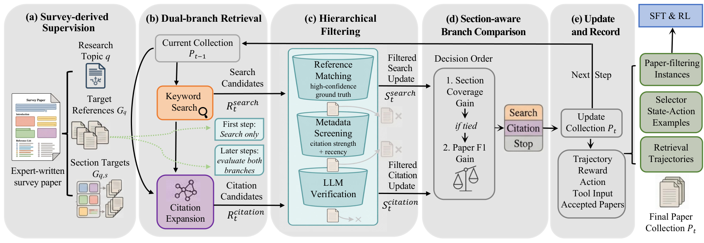

# DeepSearch

[](#dataset-scale)
[](#dataset-scale)
[](#dataset-scale)
[](#dataset-scale)
[](./pyproject.toml)

**What Makes a Good Deep Search? Rethinking Trajectory Construction, Agent
Frameworks, and Evaluation Methodologies**

Official code for process-supervised, survey-oriented literature retrieval.
The system combines keyword search, citation expansion, a paper filter, and a
retrieval-action selector. It includes:

- a section-aware, compare-then-update trajectory constructor;
- SFT data builders for the paper filter and action selector;
- an inference agent with interchangeable retrieval backends and models;
- SFT and VERL-compatible selector-RL entry points;
- reference, section-coverage, temporal, influence, and composite metrics;
- an entirely offline example and unit tests.

The repository intentionally contains code and small synthetic examples only.
Research data and model checkpoints are released separately.

<p align="center">
  
</p>

<p align="center"><em>Overview of the section-aware, compare-then-update trajectory construction pipeline.</em></p>

## Dataset Scale

The release is built from **3K+ expert-written survey topics** and their
constructed retrieval trajectories. It further contains approximately
**1.20 million topic-paper examples** for paper-filter training. Evaluation
uses a non-overlapping benchmark of **300 survey topics**. The code repository
contains only a small synthetic example; the complete research data will be
distributed through Hugging Face.

## Resources

- Code: https://github.com/Jacko-chen/deepsearch
- Hugging Face dataset:
- Model checkpoints: **TBA**

## Installation

Python 3.10 or newer is required.

```bash
git clone https://github.com/Jacko-chen/deepsearch.git
cd deepsearch
python -m venv .venv
source .venv/bin/activate
pip install -e .
```

Install optional dependencies only when needed:

```bash
pip install -e ".[api]"    # live AMiner backend
pip install -e ".[train]"  # Qwen inference and SFT
pip install -e ".[dev]"    # development checks
```

## Five-minute offline example

No API key, external dataset, GPU, or model checkpoint is required:

```bash
deepsearch-demo --output-dir outputs/demo
```

This command constructs a supervised trajectory from
`examples/topic.json`, runs the inference agent over
`examples/corpus.json`, and writes:

```text
outputs/demo/
├── agent_result.json
├── constructed_trajectory.json
└── metrics.json
```

The example uses deterministic heuristic replacements for the learned filter
and selector. The retrieval pipeline and file interfaces are the same when
real checkpoints are supplied.

## Pipeline

### Trajectory construction

At the first round, the constructor performs keyword search. At later rounds,
it evaluates keyword-search and citation-expansion branches, filters their
candidates, and chooses the update with higher section coverage and then
paper-level F1:

```bash
deepsearch-construct \
  --topic examples/topic.json \
  --corpus examples/corpus.json \
  --output outputs/trajectory.json \
  --max-steps 5
```

Survey references and section targets are construction-time supervision.
`DeepSearchAgent` does not access either at inference time.

### Inference with trained checkpoints

```python
from deepsearch.agent import DeepSearchAgent
from deepsearch.backends.aminer import AMinerBackend
from deepsearch.models import TransformersActionSelector, TransformersPaperFilter

backend = AMinerBackend()  # reads AMINER_API_KEY
paper_filter = TransformersPaperFilter(
    "Qwen/Qwen3-8B",
    adapter_path="/path/to/filter-adapter",
)
selector = TransformersActionSelector(
    "Qwen/Qwen3-8B",
    adapter_path="/path/to/selector-adapter",
)
result = DeepSearchAgent(backend, paper_filter, selector).retrieve(
    "Graph neural networks for recommender systems"
)
```

Set credentials outside source code:

```bash
cp .env.example .env
export AMINER_API_KEY="your-key"
```

The AMiner service is external and its response schema or access policy may
change. `RetrievalBackend` can be implemented for another paper-search
provider without changing the constructor or agent.

## Preparing SFT data

### Paper-filter labels

Input is JSONL with one candidate per line. Reference papers are positive.
For candidates outside the bibliography, three independent judge decisions
are expected: unanimous positive votes create a supplementary positive,
whereas at least two negative votes create a negative. Remaining cases are
excluded. Similarity fields used for candidate organization are deliberately
removed from model inputs.

```bash
python scripts/build_filter_data.py \
  --input /path/to/filter_candidates.jsonl \
  --train-output data/filter_train.jsonl \
  --validation-output data/filter_validation.jsonl
```

### Selector trajectories

```bash
python scripts/build_selector_data.py \
  --input /path/to/trajectories.jsonl \
  --train-output data/selector_train.jsonl \
  --validation-output data/selector_validation.jsonl
```

Splits are group-based to avoid topic or trajectory leakage. The input and
output fields are summarized in the Data formats section below.

## Training

The provided SFT trainer consumes JSONL records containing a `messages`
conversation. It masks prompt tokens and optimizes only assistant outputs.
LoRA is enabled by default.

```bash
python scripts/train_filter_sft.py \
  --model Qwen/Qwen3-8B \
  --train-file data/filter_train.jsonl \
  --validation-file data/filter_validation.jsonl \
  --output-dir checkpoints/filter

python scripts/train_selector_sft.py \
  --model Qwen/Qwen3-8B \
  --train-file data/selector_train.jsonl \
  --validation-file data/selector_validation.jsonl \
  --output-dir checkpoints/selector
```

For selector RL, install an upstream [VERL](https://github.com/volcengine/verl)
checkout and provide its path plus the prepared Parquet files:

```bash
export VERL_DIR=/path/to/verl
export MODEL_PATH=/path/to/sft-selector
export TRAIN_DATA=/path/to/train.parquet
export VAL_DATA=/path/to/validation.parquet
bash scripts/train_selector_rl.sh
```

Additional VERL overrides can be appended to the command. The custom reward
entry point is `src/deepsearch/training/verl_reward.py`. The environment
should attach final collection reward and trajectory state through
`extra_info`.

## Evaluation

```bash
deepsearch-evaluate \
  --topic examples/topic.json \
  --collection outputs/demo/agent_result.json
```

The local evaluator implements metrics that can be derived from released
metadata. LLMJudge requires separately configured model APIs; its
model-agnostic prompt is in `prompts/llm_judge.txt`.

## Repository layout

```text
src/deepsearch/
  agent.py          inference loop
  construction.py   compare-then-update trajectory construction
  filters.py        filter interface and candidate screening
  selectors.py      selector interface and output parser
  models.py         optional Transformers checkpoint adapters
  metrics.py        automatic evaluation metrics
  rewards.py        selector-RL format/action rewards
  backends/         in-memory and AMiner retrieval backends
  training/         SFT utilities and the VERL reward entry point
scripts/            data preparation and training entry points
prompts/            released prompt templates
examples/           small synthetic runnable inputs
tests/              offline unit and integration tests
```

## Data formats

### Topic

```json
{
  "topic_id": "stable-topic-id",
  "topic": "survey title or retrieval topic",
  "survey_year": 2025,
  "target_references": ["paper-id"],
  "section_targets": {"Section title": ["paper-id"]}
}
```

`target_references` and `section_targets` are used only for construction and
evaluation and are never passed to the inference agent.

### Paper

```json
{
  "id": "paper-id",
  "title": "Paper title",
  "abstract": "Abstract text",
  "year": 2024,
  "citation_count": 10,
  "venue": "Venue",
  "keywords": ["keyword"],
  "authors": ["Author"],
  "references": ["paper-id"],
  "cited_by": ["paper-id"]
}
```

Only `id` and `title` are required. Citation edges are used by the offline
backend; live backends retrieve them from their providers.

### Raw filter candidate

```json
{
  "topic_id": "topic-id",
  "topic": "survey topic",
  "in_reference": false,
  "judge_votes": ["yes", "yes", "yes"],
  "paper": {"id": "paper-id", "title": "Paper title"}
}
```

Source-reference papers are positive. Three positive votes create a
supplementary positive, at least two negative votes create a negative, and
the remaining out-of-reference candidates are excluded.

### Constructed trajectory

Each trajectory contains `topic_id`, `topic`, a list of `steps`, and
`final_collection`. Each step records its state, selected `action`,
`tool_input`, candidates, accepted papers, accumulated collection, reward,
and both branch results. Actions are `search`, `citation`, and `stop`.

### SFT record

Both builders output JSONL records containing a `messages` conversation.
Filter targets are `yes` or `no`; selector targets follow the strict
`search`, `citation`, or `END` format defined in `prompts/selector.txt`.

## Reproducibility and security

Large datasets, generated outputs, checkpoints, experiment logs, and secrets
are ignored by Git. Do not commit API keys. The code imported from research
prototypes was reorganized to remove machine-specific paths and embedded
credentials. If a credential was previously committed elsewhere, rotate it
before making that repository public.

Run all offline checks with:

```bash
make check
```

## Citation

Citation metadata will be updated after publication. See `CITATION.cff`.

## License

MIT License. See [LICENSE](LICENSE).
